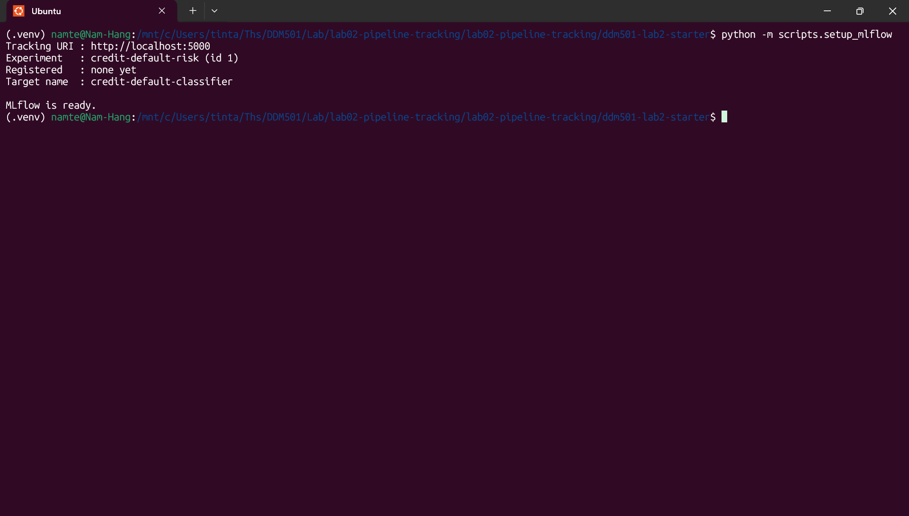
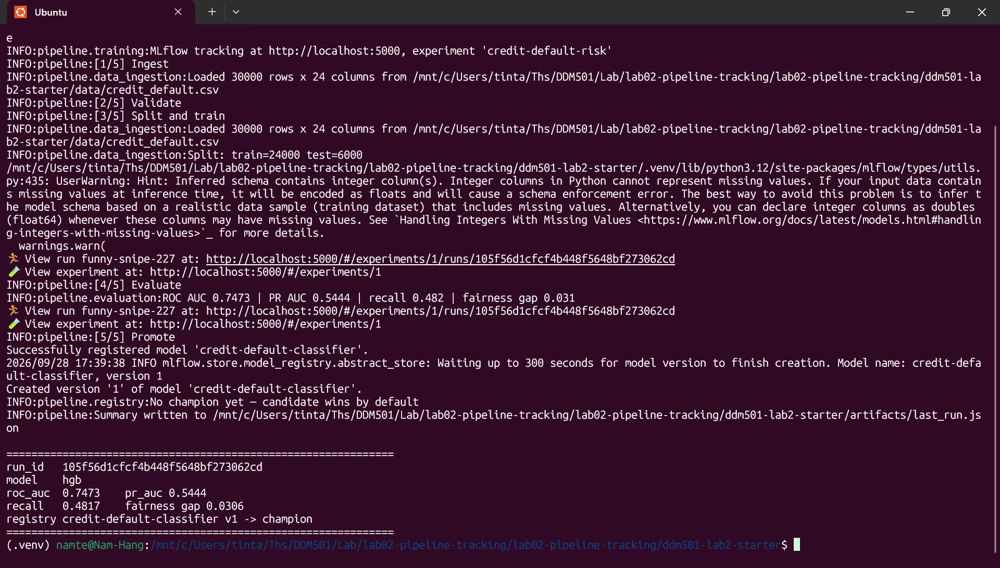
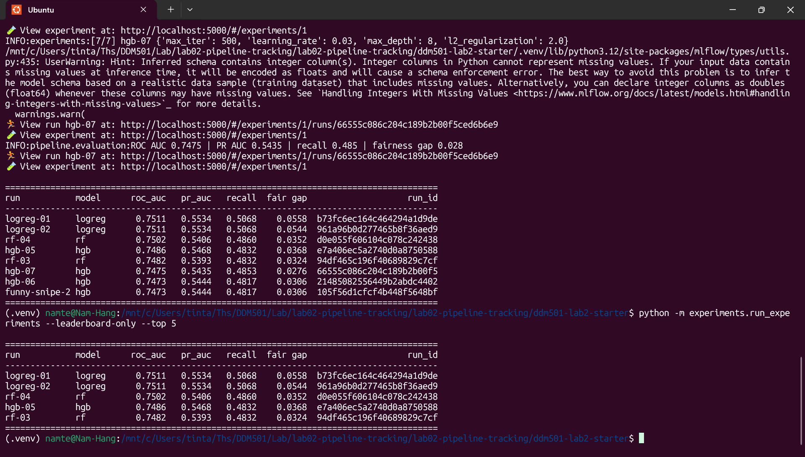
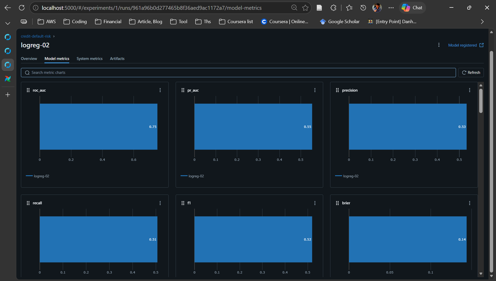
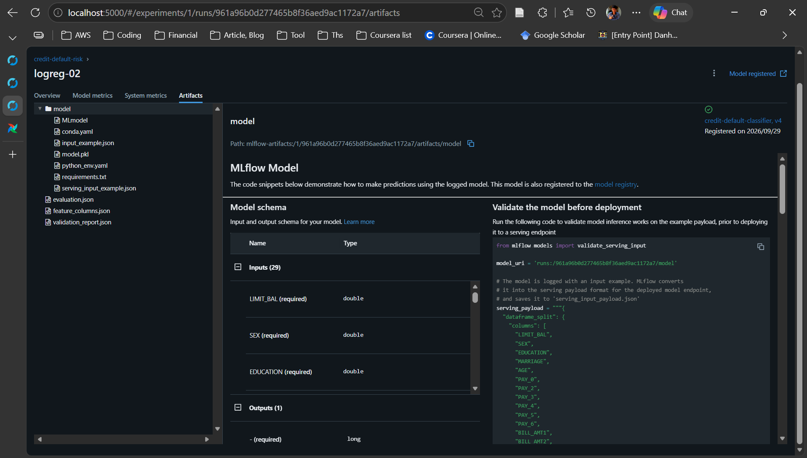
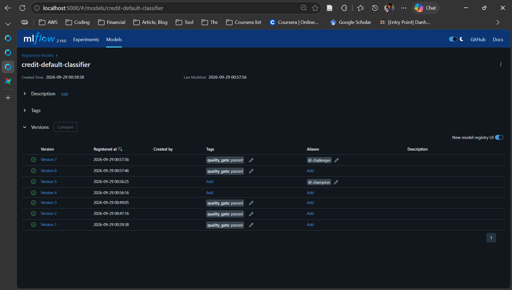
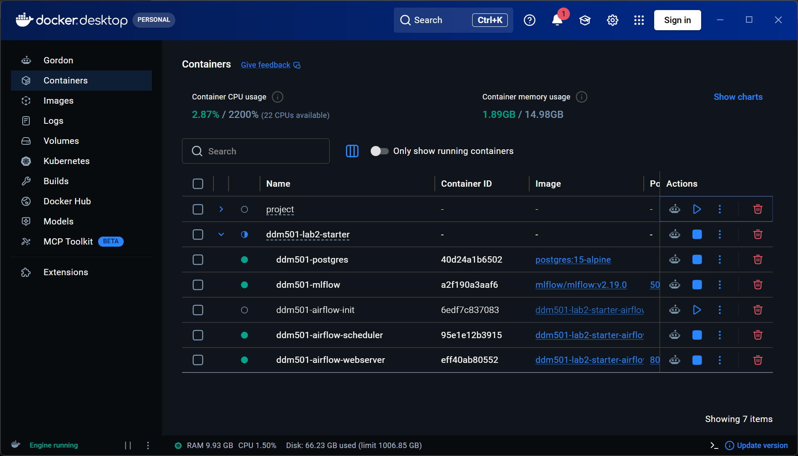
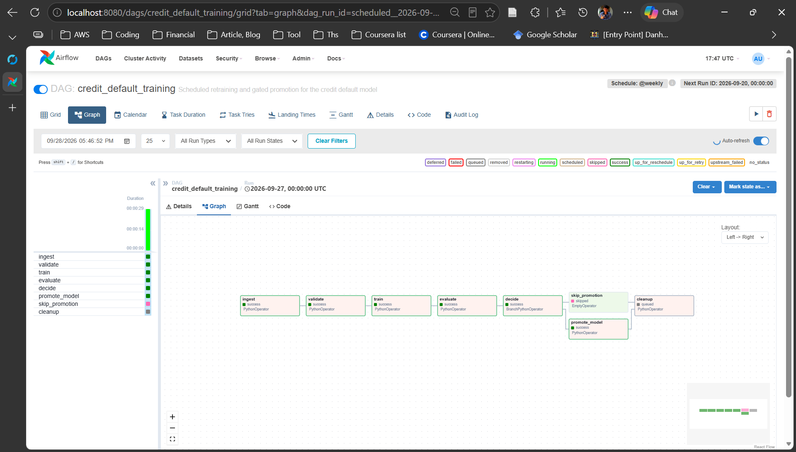

# Lab 2 — ML Pipeline & Experiment Tracking

DDM501 · AI in DevOps, DataOps, MLOps · FSB

Lab 1 produced one model from one script. That does not survive contact with a
real team: nobody can say which data produced it, which hyperparameters won, or
why this version rather than the last one. This lab turns that script into a
pipeline whose every run is recorded, comparable, and — when it earns it —
promoted automatically.

Same credit default problem as Lab 1. Same data. The question changes from
*does it serve?* to *can you reproduce it, compare it, and decide about it?*

This repository contains the Lab 2 implementation built from the provided
starter. Captured execution results are collected in [Submission evidence](#submission-evidence).

---

## Lab implementation scope

| File | Original starter TODOs | What it is |
|---|---|---|
| `pipeline/validation.py` | 4 | The three-level data quality gate |
| `pipeline/preprocessing.py` | 2 | Derived features and the ColumnTransformer |
| `pipeline/training.py` | 1 | MLflow tracking around the fit |
| `pipeline/evaluation.py` | 3 | Metrics, per-group metrics, fairness gap |
| `pipeline/registry.py` | 5 | Best run, register, alias, quality gate, promotion |
| `dags/credit_training_dag.py` | 6 | Five task bodies and the dependency graph |
| `tests/test_pipeline.py` | 5 classes | Everything except `TestDataIngestion` |
| `docker/airflow.Dockerfile` | 3 | User, constrained install, PYTHONPATH |
| `docker-compose.yml` | 1 | The MLflow service |

The starter provided these worked examples:
`pipeline/config.py`, `pipeline/data_ingestion.py`, `pipeline/run_pipeline.py`,
the `ingest` and `cleanup` tasks in the DAG, `beats_champion` and the helper
functions in `registry.py`, and `TestDataIngestion` in the test file.

The automated acceptance workflow is `.github/workflows/smoke.yml`. It runs the pipeline,
asserts a model reached the `@champion` alias, runs the sweep, then installs
Airflow and parses the DAG. That workflow is the specification; this README is
the explanation.

---

## Submission evidence

The screenshots below record the observed results for Lab 2 section 5. They are
stored in [screenshot/](screenshot/) so the evidence can be viewed directly on
GitHub. Values and registry aliases describe the captured state.

### MLflow setup and CLI pipeline

The setup check connects to `http://localhost:5000`, finds the
`credit-default-risk` experiment, and confirms that no model is registered yet.



The first CLI run completes all five stages: ingest, validate, split and train,
evaluate, and promote. It loads 30,000 rows, splits them into 24,000 training and
6,000 test rows, and registers HGB as version 1 with the `champion` alias.
The captured run ID is `105f56d1cfcf4b448f5648bf273062cd`.

| Metric | Captured value |
|---|---:|
| ROC AUC | 0.7473 |
| PR AUC | 0.5444 |
| Recall | 0.4817 |
| Fairness gap | 0.0306 |



### Experiment sweep leaderboard

The sweep capture shows all seven configurations across logistic regression,
random forest, and histogram gradient boosting, plus the initial CLI run. It
also shows the output of `--leaderboard-only --top 5`.

| Sweep run | Model | ROC AUC | PR AUC | Recall | Fairness gap |
|---|---|---:|---:|---:|---:|
| logreg-01 | Logistic regression | 0.7511 | 0.5534 | 0.5068 | 0.0558 |
| logreg-02 | Logistic regression | 0.7511 | 0.5534 | 0.5068 | 0.0544 |
| rf-04 | Random forest | 0.7502 | 0.5406 | 0.4860 | 0.0352 |
| hgb-05 | Histogram gradient boosting | 0.7486 | 0.5468 | 0.4832 | 0.0368 |
| rf-03 | Random forest | 0.7482 | 0.5393 | 0.4832 | 0.0324 |
| hgb-07 | Histogram gradient boosting | 0.7475 | 0.5435 | 0.4853 | 0.0276 |
| hgb-06 | Histogram gradient boosting | 0.7473 | 0.5444 | 0.4817 | 0.0306 |

Values are transcribed at the screenshot's four-decimal precision. Logistic
regression has the highest displayed ROC AUC, PR AUC, and recall, but also the
largest fairness gaps. All seven configurations pass the configured thresholds
of ROC AUC >= 0.70, PR AUC >= 0.45, and fairness gap <= 0.10. The leaderboard
therefore exposes a performance-versus-fairness trade-off even among eligible
models; ranking first does not itself change the registry alias.



### Promotion decision

I would promote **logreg-02**. It achieves ROC AUC **0.7511**, PR AUC **0.5534**,
and recall **0.5068**, while its fairness gap of **0.0544** remains below the
configured **0.10** limit. It therefore satisfies all three quality checks.
Compared with the initial HGB champion's ROC AUC of **0.7473**, its improvement
is approximately **0.0038**, exceeding the required **0.002** promotion margin.

This choice accepts a larger fairness gap than the initial HGB champion's
**0.0306** in exchange for stronger predictive performance and higher recall.
The gap remains within the lab's configured tolerance; passing that threshold
does not mean the model has no demographic disparity. Between the two logistic
regression configurations, logreg-02 has the smaller fairness gap, while their
ROC AUC, PR AUC, and recall are tied at the displayed precision.

### MLflow metrics and artifacts

The metrics view shows `logreg-02`, the logistic regression run selected in the
promotion decision, with run ID `961a96b0d277465b8f36aed9ac1172a7`.
The displayed scores are ROC AUC **0.75**, PR AUC **0.55**, precision **0.53**,
recall **0.51**, F1 **0.52**, and Brier score **0.14**. The UI rounds these values
to two decimal places; the leaderboard above provides four-decimal values for
ROC AUC, PR AUC, recall, and fairness gap.



The artifacts view for the same `logreg-02` run links to
`credit-default-classifier` **version 4**. It shows the fitted `model.pkl`,
`MLmodel` metadata, input and serving examples, and environment files
(`conda.yaml`, `python_env.yaml`, and `requirements.txt`). The run also contains
`evaluation.json`, `feature_columns.json`, and `validation_report.json`.
The model schema lists **29 input features** and one output. Together, these
artifacts record the fitted model, expected inputs, dependencies, evaluation,
and validation evidence needed to inspect and reuse the run.

The screenshot shows artifacts and the input schema; the logged hyperparameter
table would require a separate run Overview capture or parameter export.



### Model registry aliases

The updated registry capture shows seven versions of `credit-default-classifier`,
with version 5 assigned the `champion` alias and version 7 assigned `challenger`.
Version 7 is tagged `quality_gate: passed`; version 5 has no visible quality-gate
tag in this view. Earlier versions remain listed, preserving the registration
history as aliases move between versions.



### Docker stack and Airflow branching

Docker Desktop shows PostgreSQL, MLflow, the Airflow scheduler, and the Airflow
webserver running. The separate initialization container is stopped.



The Airflow graph shows `ingest -> validate -> train -> evaluate -> decide`,
followed by the two promotion branches and `cleanup`. In this capture,
`promote_model` succeeded and `skip_promotion` was skipped, demonstrating the
branch decision. **`cleanup` is still queued in the screenshot**, so this image
does not yet prove that the entire DAG run finished successfully. Capture the
graph again after `cleanup` and the DAG run report success for the final submission.



The [Lab 2 report](report/lab2-report.md) covers all five section 5.2 topics:
pipeline design, experiment analysis, the promotion decision, orchestration,
and reproducibility.

---

## The pipeline


Each stage is a module in `pipeline/`. The CLI, the tests and the Airflow DAG
all call the same functions — the DAG orchestrates, it never reimplements.

---

## Quick start

```bash
python -m venv .venv
source .venv/bin/activate          # Windows: .venv\Scripts\activate
pip install -r requirements.txt

# Runs against a local file store at ./mlruns — no server needed
python -m pipeline.run_pipeline

# Look at what it recorded
mlflow ui --backend-store-uri ./mlruns      # http://localhost:5000
```

With the tracking server instead:

```bash
docker compose up -d mlflow
export MLFLOW_TRACKING_URI=http://localhost:5000
python scripts/setup_mlflow.py             # confirms it is reachable
python -m pipeline.run_pipeline
```

Sweep the hyperparameter grid and print a leaderboard:

```bash
python -m experiments.run_experiments
python -m experiments.run_experiments --leaderboard-only --top 5
```

---

## The full stack

```bash
docker compose up -d --build

# MLflow   http://localhost:5000
# Airflow  http://localhost:8080   (airflow / airflow)
```

Unpause `credit_default_training` in the Airflow UI and trigger it. Eight tasks:

| Task | Does |
|---|---|
| `ingest` | Load the CSV, split it, write the split to the shared volume |
| `validate` | Schema, statistics and semantics. Raises and stops the DAG on failure |
| `train` | Fit the pipeline inside an MLflow run |
| `evaluate` | Aggregate metrics, per-group metrics, fairness gap — all logged |
| `decide` | Branch on the quality gate |
| `promote_model` / `skip_promotion` | Register and alias, or do nothing |
| `cleanup` | Remove the run directory down whichever branch ran |

---

## Two dependency sets, on purpose

`requirements.txt` has no Airflow in it. That is not an oversight.

Airflow pins several hundred transitive dependencies. Installing it next to
MLflow in one environment makes pip backtrack for minutes and often fails; when
it does succeed it silently downgrades things MLflow needs. So:

| File | Used by | Notes |
|---|---|---|
| `requirements.txt` | Your laptop, CI, the tests | numpy 2.2, pandas 2.2, scikit-learn 1.6 |
| `requirements-airflow.txt` | `docker/airflow.Dockerfile` only | numpy 1.24, pandas 2.1 — **pinned by Airflow's own constraints** |

The two sets disagree on numpy and pandas versions, and that is fine: they never
share an interpreter. Trying to reconcile them is how people lose an afternoon.

The Airflow image installs those packages **with Airflow's constraints file**.
Skipping the constraint is the fastest way to break a working scheduler.

---

## MLflow aliases, not stages

MLflow deprecated model registry stages (`Staging`, `Production`) in 2.9 and
will remove them. This lab uses **aliases**:

```python
client.set_registered_model_alias(name, alias="champion", version="4")
model = mlflow.sklearn.load_model("models:/credit-default-classifier@champion")
```

| | Stages (deprecated) | Aliases |
|---|---|---|
| Promotion | mutates the version's state | moves a pointer |
| History | overwritten | intact — versions are immutable |
| Count | four fixed names | as many as you need |

Two aliases are used here: `@champion` is what a serving layer would load,
`@challenger` is a candidate that passed the gate but did not beat the champion.

---

## The quality gate

`promote_model` never promotes on accuracy alone. Three checks, all must pass:

```
roc_auc    >= 0.70
pr_auc     >= 0.45
fairness_gap <= 0.10
```

and then the candidate must beat the current champion by a margin of 0.002 —
without the margin, noise triggers deployments.

The fairness check is the interesting one. `fairness_gap` is the largest
difference in *selection rate* (the share of applicants sent to review or
decline) between demographic groups. A model can be the most accurate candidate
in the sweep and still be refused promotion here.

Run the sweep and look at the leaderboard: logistic regression usually posts the
best ROC AUC **and** the widest fairness gap. Deciding what to do about that is
the point of the exercise, and Session 6 gives you the vocabulary for it.

---

## Project structure

```
.
├── pipeline/
│   ├── config.py           Everything configurable, all env-overridable
│   ├── data_ingestion.py   Load, stratified split, dataset stats
│   ├── validation.py       Schema / statistics / semantics gate
│   ├── preprocessing.py    Derived features + the sklearn ColumnTransformer
│   ├── training.py         Fit inside an MLflow run
│   ├── evaluation.py       Metrics, per-group metrics, fairness gap
│   ├── registry.py         Register, alias, quality gate, promotion
│   └── run_pipeline.py     CLI entry point
├── experiments/
│   └── run_experiments.py  Grid sweep + leaderboard
├── dags/
│   └── credit_training_dag.py
├── docker/
│   └── airflow.Dockerfile
├── data/credit_default.csv Committed — the lab needs no network
├── tests/test_pipeline.py
├── screenshot/            Captured CLI, MLflow, Docker, and Airflow evidence
├── docker-compose.yml
├── requirements.txt
└── requirements-airflow.txt
```

---

## Tests

```bash
pytest tests/ -v --cov=pipeline --cov-report=term-missing
```

| Class | Asserts |
|---|---|
| `TestDataIngestion` | The split is stratified, reproducible, and leaks nothing |
| `TestValidation` | Every category of bad data is caught and stops the run |
| `TestPreprocessing` | Derived features are correct; the transformer lives inside the Pipeline |
| `TestTraining` | Every model type builds and fits; params override defaults |
| `TestEvaluation` | Metrics are in range and internally consistent; slices cover everyone |
| `TestQualityGate` | An accurate but unfair model is rejected; a missing metric fails closed |

`test_split_is_reproducible` looks trivial and is not. Without a fixed seed,
every metric comparison in MLflow measures split noise as much as model
quality — and you would never know, because the numbers still look plausible.

---

## Troubleshooting

**`Experiment 'credit-default-risk' not found`**
Nothing has been logged yet. Run the pipeline once, or `python scripts/setup_mlflow.py`.

**`Cannot reach the tracking server`**
`MLFLOW_TRACKING_URI` points at a server that is not running. Either
`docker compose up -d mlflow`, or unset the variable to fall back to `./mlruns`.

**Airflow UI shows the DAG as broken, with an import error**
The image does not have the pipeline's dependencies. Rebuild it:
`docker compose build airflow-scheduler`. Do not `pip install` inside a running
container — the change disappears on the next restart.

**`pip install` takes forever or fails after you added Airflow to requirements.txt**
Take it back out. See "Two dependency sets" above.

**`transition_model_version_stage is deprecated`**
You are using the old stage API. Use `set_registered_model_alias` instead.

**Every test passes before you have written anything**
A stub whose body is `pass` returns `None`, and pytest counts that as a pass.
Delete the `pass` as you implement each test.

**`airflow dags list` shows the DAG but the graph in the UI is a flat row**
You have not wired the dependencies yet — TODO 6 at the bottom of the DAG file.

**Every experiment run gets the same metrics**
Check that you are passing the sweep's parameters into `train_model`. It is easy
to build the config dict and never use it — the runs then differ only by name.

**The DAG runs but nothing appears in MLflow**
Inside the compose network the tracking server is `http://mlflow:5000`, not
`http://localhost:5000`. `localhost` inside a container is that container.
