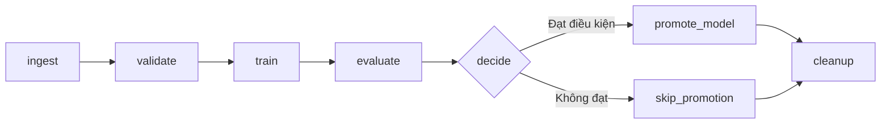

# Báo cáo Lab 2 — Pipeline học máy và theo dõi thí nghiệm

**Môn học:** DDM501 — AI in DevOps, DataOps, MLOps  
**Kho mã nguồn:** [msa36hn-ddm501-lab2](https://github.com/NamTe/msa36hn-ddm501-lab2)  
**Ngày báo cáo:** 29/09/2026  
**Bản tiếng Anh:** [lab2-report.md](lab2-report.md)


## 1. Thiết kế pipeline

### Năm giai đoạn và trách nhiệm

Điểm khởi chạy chính là DAG Airflow `credit_default_training`, được định nghĩa
trong [`dags/credit_training_dag.py`](../dags/credit_training_dag.py). Mỗi lần
chạy theo lịch hoặc kích hoạt thủ công sẽ điều phối pipeline bằng các hàm dùng
chung trong `pipeline/`. Năm giai đoạn logic được triển khai bằng tám task:
`ingest`, `validate`, `train`, `evaluate`, `decide`, `promote_model`,
`skip_promotion` và `cleanup`. Việc chọn nhánh và dọn dẹp hỗ trợ quy trình năm
giai đoạn này.

| Giai đoạn | Trách nhiệm | Đầu ra chính |
|---|---|---|
| Ingest — Nạp dữ liệu (`ingest`) | Đọc CSV bằng `data_ingestion.py`, tính thống kê, chia tập có phân tầng và lưu vào vùng dùng chung. | `raw.parquet`, `split.joblib`, thống kê dữ liệu và đường dẫn thư mục trong XCom. |
| Validate — Kiểm tra dữ liệu (`validate`) | Kiểm tra cấu trúc, thống kê và ý nghĩa nghiệp vụ của dữ liệu thô đã lưu bằng `validation.py`; dừng khi dữ liệu không hợp lệ. | `validation_report.json` và báo cáo validation trong XCom. |
| Train — Huấn luyện (`train`) | Đọc tập chia đã lưu, tạo đặc trưng, huấn luyện bộ tiền xử lý và mô hình, ghi nhận lần chạy trong MLflow. | `model.joblib`, artifact MLflow và run ID trong XCom. |
| Evaluate — Đánh giá (`evaluate`) | Đánh giá trên tập kiểm tra, tính chỉ số tổng thể và theo nhóm, đo chênh lệch tỷ lệ được chọn. | `evaluation.json`, chỉ số trong MLflow và chỉ số vô hướng trong XCom. |
| Decide and promote — Quyết định và xét chọn (`decide`, `promote_model` / `skip_promotion`) | Áp dụng quality gate, chọn nhánh, đăng ký và so sánh ứng viên đủ điều kiện với champion hiện tại. | Kết quả quality gate và promotion trong XCom; phiên bản đăng ký và alias phù hợp khi nhánh promotion chạy. |

`cleanup` xóa thư mục tạm sau khi nhánh được chọn hoàn tất thành công. MLflow
giữ lại các artifact đã ghi. Điểm khởi chạy cục bộ thay thế là
[`pipeline/run_pipeline.py`](../pipeline/run_pipeline.py), dùng cùng các hàm
pipeline và ghi `artifacts/last_run.json`; đây là đầu ra của CLI, không phải
tệp do DAG tạo ra.

### Kiểm tra dữ liệu là một bước chặn độc lập

Validation nằm sau bước nạp dữ liệu và trước bước huấn luyện; hai vị trí này bổ sung cho nhau. Ingestion xác nhận có thể đọc được tệp, còn validation xác nhận nội dung đáp ứng các điều kiện để huấn luyện. Tách riêng validation giúp kết quả kiểm tra rõ ràng, dùng chung được giữa CLI và DAG, đồng thời lưu được dưới dạng artifact trong MLflow. Một tệp CSV đọc được vẫn có thể chứa mã phân loại không hợp lệ, tuổi bất thường hoặc phân bố nhãn sai.

Bộ kiểm tra yêu cầu các cột số cần thiết, tối thiểu 5.000 dòng, tỷ lệ thiếu không quá 2% ở từng cột và tỷ lệ nhãn dương trong khoảng 5%–60%. Kiểm tra ngữ nghĩa bao gồm miền giá trị của biến phân loại, giới hạn tuổi và hạn mức tín dụng, khoảng giá trị trễ hạn và số tiền thanh toán không âm. Lỗi ở cả ba mức được tổng hợp trước khi phát sinh `DataValidationError`, ngăn mô hình được huấn luyện trên dữ liệu không đạt yêu cầu.

Trong DAG, task ingestion tạo tập chia trước, nhưng task validation phía sau vẫn chặn huấn luyện nếu dữ liệu thô không hợp lệ. Chia tập chưa thực hiện fit bộ tiền xử lý hoặc mô hình. Luồng CLI thay thế kiểm tra dữ liệu trước khi chia tập. Với cả hai cách chạy, validation thất bại sẽ ngăn huấn luyện và xét chọn mô hình.

### Đặc trưng và phòng tránh rò rỉ dữ liệu

Dữ liệu được chia với `test_size=0.2`, `random_state=501` và phân tầng theo `default_payment_next_month`: 24.000 dòng huấn luyện và 6.000 dòng kiểm tra. Sáu đặc trưng bổ sung mở rộng 23 biến đầu vào thô thành 29 đặc trưng:

| Đặc trưng bổ sung | Cách tính |
|---|---|
| `utilisation_ratio` | Trung bình dư nợ hóa đơn chia cho hạn mức tín dụng, giới hạn trong [0, 5]. |
| `payment_ratio` | Khoản thanh toán tháng thứ nhất chia cho dư nợ hóa đơn tháng thứ nhất, giới hạn trong [0, 5]. |
| `max_delay` | Giá trị trễ hạn lớn nhất trong sáu tháng. |
| `n_months_delayed` | Số tháng có giá trị trễ hạn lớn hơn 0. |
| `avg_bill_amt` | Trung bình dư nợ hóa đơn của sáu tháng. |
| `avg_pay_amt` | Trung bình khoản thanh toán của sáu tháng. |

Hàm tạo đặc trưng trả về bản sao và thay mẫu số bằng 0 bằng NaN. Biến số được điền giá trị thiếu bằng trung vị rồi chuẩn hóa bằng StandardScaler. Các biến phân loại `SEX`, `EDUCATION` và `MARRIAGE` được mã hóa one-hot, bỏ qua nhóm chưa gặp. Bộ biến đổi được fit bên trong pipeline sklearn chỉ trên tập huấn luyện, tránh dùng thống kê của tập kiểm tra để điền dữ liệu thiếu hoặc chuẩn hóa.

Bước tạo sáu đặc trưng được gọi trước pipeline sklearn đã huấn luyện. Vì vậy, khi sử dụng mô hình đã lưu với dữ liệu thô, cần gọi `prepare_features` trước.

Đồ thị DAG và minh chứng XCom của từng task được trình bày ở mục 4. Ảnh CLI
dưới đây bổ sung minh chứng rằng các hàm pipeline dùng chung cũng có thể chạy
trong môi trường cục bộ.


*Lần chạy HGB ban đầu hoàn tất đánh giá và đăng ký phiên bản 1 làm champion, đạt ROC AUC 0.7473, PR AUC 0.5444 và fairness gap 0.0306.*

## 2. Phân tích thí nghiệm

### Thiết kế thử nghiệm và kết quả

[`experiments/run_experiments.py`](../experiments/run_experiments.py) đánh giá bảy cấu hình trên cùng một cách chia dữ liệu. Mỗi cấu hình có một MLflow run riêng. Việc giữ nguyên dữ liệu, seed, cách tiền xử lý và ngưỡng quyết định giúp so sánh nhất quán hơn so với chia lại dữ liệu độc lập cho từng mô hình.

| Lần chạy | Cấu hình |
|---|---|
| `logreg-01` | C=0.1, max_iter=1000 |
| `logreg-02` | C=1.0, max_iter=1000 |
| `rf-03` | n_estimators=200, max_depth=8, min_samples_leaf=20 |
| `rf-04` | n_estimators=300, max_depth=12, min_samples_leaf=20 |
| `hgb-05` | max_iter=200, learning_rate=0.10, max_depth=4, l2_regularization=1.0 |
| `hgb-06` | max_iter=300, learning_rate=0.06, max_depth=6, l2_regularization=1.0 |
| `hgb-07` | max_iter=500, learning_rate=0.03, max_depth=8, l2_regularization=2.0 |

Bảng sau chép lại kết quả của bảy cấu hình với bốn chữ số thập phân như trong ảnh. Ảnh chụp còn hiển thị lần chạy HGB ban đầu từ CLI. Các số thập phân giữ dấu chấm để thống nhất với đầu ra chương trình.

| Lần chạy | Nhóm mô hình | ROC AUC | PR AUC | Recall | Fairness gap |
|---|---|---:|---:|---:|---:|
| logreg-01 | Hồi quy logistic | 0.7511 | 0.5534 | 0.5068 | 0.0558 |
| logreg-02 | Hồi quy logistic | 0.7511 | 0.5534 | 0.5068 | 0.0544 |
| rf-04 | Random forest | 0.7502 | 0.5406 | 0.4860 | 0.0352 |
| hgb-05 | Histogram gradient boosting | 0.7486 | 0.5468 | 0.4832 | 0.0368 |
| rf-03 | Random forest | 0.7482 | 0.5393 | 0.4832 | 0.0324 |
| hgb-07 | Histogram gradient boosting | 0.7475 | 0.5435 | 0.4853 | 0.0276 |
| hgb-06 | Histogram gradient boosting | 0.7473 | 0.5444 | 0.4817 | 0.0306 |


### Những nhận xét rút ra từ thí nghiệm

Hồi quy logistic có ROC AUC, PR AUC và recall hiển thị cao nhất. Tăng C từ 0.1 lên 1.0 không làm thay đổi các chỉ số này ở độ chính xác đang hiển thị, nhưng giảm fairness gap từ 0.0558 xuống 0.0544. Ảnh chụp không chứng minh rằng các chỉ số bằng nhau ở những chữ số thập phân tiếp theo.

Cấu hình random forest lớn hơn cải thiện ROC AUC từ 0.7482 lên 0.7502 và PR AUC từ 0.5393 lên 0.5406, nhưng fairness gap tăng từ 0.0324 lên 0.0352. Tăng năng lực mô hình có thể cải thiện một số chỉ số dự đoán mà không đồng thời cải thiện mọi mục tiêu.

Trong nhóm HGB, `hgb-05` có ROC AUC và PR AUC cao nhất. Cấu hình `hgb-07` có cây sâu hơn và số vòng lặp lớn hơn, đạt fairness gap thấp nhất toàn bộ thí nghiệm, 0.0276, nhưng ROC AUC và PR AUC thấp hơn `hgb-05`. Do nhiều siêu tham số thay đổi cùng lúc, thí nghiệm chưa tách riêng được tác động của độ sâu hoặc learning rate.

Chênh lệch ROC AUC cao nhất và thấp nhất chỉ là 0.0038. Fairness gap thay đổi rõ hơn, từ 2,76 đến 5,58 điểm phần trăm. Vì vậy, chỉ nhìn thứ hạng theo một chỉ số sẽ bỏ qua sự đánh đổi giữa khả năng phân biệt của mô hình và chênh lệch tỷ lệ được chọn giữa các nhóm.

Chỉ số có tên `pr_auc` được cài đặt bằng `average_precision_score` của sklearn. Recall và các chỉ số phân loại dùng ngưỡng xác suất 0.30. Fairness gap là hiệu giữa tỷ lệ được chọn lớn nhất và nhỏ nhất trong các nhóm `SEX` đủ điều kiện; một mẫu được chọn khi xác suất dự đoán >= 0.30. Chỉ số này đo chênh lệch tỷ lệ được chọn, không chứng minh sự ngang bằng về tỷ lệ lỗi hay tính công bằng toàn diện. Nhóm có dưới 50 mẫu hoặc chỉ có một lớp nhãn bị bỏ qua, nên cần kiểm tra cả phạm vi nhóm được đánh giá.

Các cấu hình được so sánh nhiều lần trên cùng một tập kiểm tra. Kết quả hỗ trợ quyết định trong phạm vi bài lab, nhưng chưa chứng minh ý nghĩa thống kê hay hiệu năng cuối cùng không thiên lệch sau khi chọn mô hình. Một tập kiểm tra cuối cùng độc lập hoặc cross-validation sẽ giúp đánh giá triển khai chắc chắn hơn.

## 3. Quyết định lựa chọn mô hình

Tôi chọn **logreg-02**, run ID **`961a96b0d277465b8f36aed9ac1172a7`**, để đề xuất làm champion, lấy mô hình HGB ban đầu làm mốc so sánh.

| Điều kiện | Quy tắc đã cấu hình | logreg-02 | Kết quả |
|---|---|---:|---|
| ROC AUC | >= 0.70 | 0.7511 | Đạt |
| PR AUC | >= 0.45 | 0.5534 | Đạt |
| Fairness gap | <= 0.10 | 0.0544 | Đạt |
| Cải thiện so với HGB ban đầu | Mức tăng ROC AUC >= 0.002 | Khoảng 0.0038 | Đạt |

So với HGB ban đầu, recall tăng từ 0.4817 lên 0.5068, tương đương 2,51 điểm phần trăm; PR AUC tăng từ 0.5444 lên 0.5534. Tôi chấp nhận fairness gap tăng từ 0.0306 lên 0.0544 vì vẫn nằm trong giới hạn đã cấu hình, trong khi hiệu năng dự đoán được cải thiện. Tôi giữ nguyên ngưỡng 0.10 và tiếp tục theo dõi tỷ lệ được chọn cùng các chỉ số lỗi theo nhóm, thay vì nới ngưỡng để một mô hình ưu tiên được chấp nhận.

Giữa hai cấu hình hồi quy logistic, `logreg-02` được chọn vì fairness gap nhỏ hơn trong khi các chỉ số khác trên bảng xếp hạng bằng nhau ở độ chính xác hiển thị. Nếu áp dụng yêu cầu nghiêm ngặt hơn đáng kể về chênh lệch giữa các nhóm, quyết định cần được xem xét lại; `hgb-07` có mức chênh lệch thấp hơn nhưng đánh đổi một phần hiệu năng dự đoán.

Hàm registry đăng ký mọi ứng viên mà nó xử lý. Ứng viên không đạt được gắn `quality_gate: failed` và không được cấp alias mới. Ứng viên đạt chỉ trở thành champion nếu vượt champion hiện tại ít nhất 0.002 ROC AUC; nếu không, nó trở thành challenger. Thiếu chỉ số cần thiết sẽ khiến điều kiện tương ứng không đạt. So sánh tự động dùng champion tại thời điểm thực thi, nên mức tăng nêu trên chỉ áp dụng khi so với HGB ban đầu.


*MLflow hiển thị giá trị làm tròn: ROC AUC 0.75, PR AUC 0.55, precision 0.53, recall 0.51, F1 0.52 và Brier score 0.14.*


*Ảnh registry hiển thị phiên bản 5 là champion và phiên bản 7 là challenger. Ảnh artifact của logreg-02 liên kết tới phiên bản 4. Các ảnh này chưa xác định run nguồn của phiên bản 5, nên chưa đủ để xác nhận độc lập rằng champion chính là logreg-02. Đề xuất lựa chọn ở trên dựa vào kết quả bảng xếp hạng.*

## 4. Điều phối bằng Airflow

DAG [`credit_default_training`](../dags/credit_training_dag.py) gọi cùng các hàm pipeline với CLI. Mặc định DAG chạy hằng tuần, tắt catchup, chỉ cho phép một lần chạy hoạt động và thử lại task một lần sau hai phút.



### XCom và vùng lưu trữ dùng chung

| Cơ chế | Nội dung | Lý do |
|---|---|---|
| XCom | Đường dẫn thư mục chạy, thống kê dữ liệu, dictionary báo cáo validation, MLflow run ID, chỉ số đánh giá dạng vô hướng, kết quả quality gate và kết quả promotion. | Metadata nhỏ giúp task tìm đầu ra và ra quyết định mà không chuyển DataFrame hay mô hình qua cơ sở dữ liệu metadata. |
| Thư mục chạy dùng chung | `raw.parquet`, `split.joblib`, `validation_report.json`, `model.joblib` và toàn bộ `evaluation.json`. | DataFrame, mô hình đã huấn luyện và kết quả chi tiết được trao đổi qua tệp mà các task phía sau có thể truy cập. |
| Kho artifact MLflow | Mô hình, danh sách đặc trưng, báo cáo validation, báo cáo đánh giá và thông tin môi trường. | Lưu bằng chứng thí nghiệm lâu dài, kể cả sau khi tệp tạm của lần chạy được dọn dẹp. |

`decide` trả về đúng task ID phía sau: `promote_model` hoặc `skip_promotion`. Đi vào nhánh promotion nghĩa là ứng viên đã vượt quality gate; hàm registry vẫn phải quyết định mô hình trở thành champion hay challenger. Quy tắc `none_failed_min_one_success` cho phép cleanup chạy khi một nhánh thành công và nhánh còn lại bị bỏ qua. Quy tắc này không dọn một lần chạy có lỗi phía trước, nên tệp tạm của lần chạy thất bại có thể còn lại.

Luồng CLI và nhánh thất bại của DAG có một khác biệt: CLI gọi `promote_model` cho ứng viên bị từ chối và tạo phiên bản bị từ chối, trong khi DAG dùng `EmptyOperator` cho `skip_promotion`. Vì vậy, khi quality gate không đạt trong DAG, nhánh này không đăng ký phiên bản bị từ chối, dù lần huấn luyện và đánh giá vẫn được ghi trong MLflow.

### Minh chứng XCom của lần chạy thủ công

Dữ liệu XCom được cung cấp cho phép theo dõi một lần chạy thủ công qua các bước nạp dữ liệu, đánh giá, chọn nhánh, đăng ký mô hình và dọn dẹp. Thư mục làm việc là `/opt/airflow/artifacts/manual__2026-09-28T17_57_18.568921_00_00`; MLflow run ID là **`c6c290c174da4f0a985bcc762142bf81`**. Đây là lần chạy khác với `logreg-02` trong sweep và khác với lần chạy theo lịch ở ảnh DAG bên dưới.

| Task | Dữ liệu XCom | Ý nghĩa |
|---|---|---|
| `ingest` | `data_stats`: 30.000 dòng, 24 cột, positive rate 0.2329, không có giá trị thiếu; `run_dir`: đường dẫn nêu trên. | Truyền thống kê và vị trí lưu dữ liệu thay cho DataFrame. |
| `validate` | `validation_report`: `passed=True`, 30.000 dòng, 24 cột, ba danh sách lỗi rỗng và `n_errors=0`. | Cả ba mức kiểm tra đã cấu hình đều đạt trước huấn luyện. |
| `train` | `mlflow_run_id`: `c6c290c174da4f0a985bcc762142bf81`. | Liên kết lần chạy DAG với mô hình và đánh giá trong MLflow. |
| `evaluate` | Dictionary gồm chỉ số vô hướng: ROC AUC, PR AUC, fairness gap và các số đếm của ma trận nhầm lẫn. | Task quyết định nhận đủ dữ liệu để xét điều kiện mà không cần tải mô hình. |
| `decide` | `quality_gate.passed=True`, `failed_checks=[]`; `return_value=promote_model`; `skipmixin_key={'followed': ['promote_model']}`. | Tất cả điều kiện đạt và Airflow chọn nhánh promotion. `skipmixin_key` là metadata quản lý nhánh của Airflow. |
| `promote_model` | Mô hình `credit-default-classifier`, phiên bản `6`, kết quả `challenger`, cùng MLflow run ID; giá trị trả về `credit-default-classifier v6: challenger`. | Mô hình được đăng ký nhưng không thay champion. |
| `cleanup` | `removed /opt/airflow/artifacts/manual__2026-09-28T17_57_18.568921_00_00`. | Hàm cleanup đã đi tới nhánh xóa thư mục và trả về trong lần chạy thủ công này. |

Payload validation ghi nhận đầy đủ kết quả kiểm tra chất lượng dữ liệu:

```json
{
  "passed": true,
  "n_rows": 30000,
  "n_columns": 24,
  "schema_errors": [],
  "statistical_errors": [],
  "semantic_errors": [],
  "n_errors": 0
}
```

Kích thước dữ liệu khớp với ingestion và cả ba danh sách lỗi đều rỗng. Kết quả xác nhận dữ liệu vượt qua các kiểm tra đã cài đặt trước khi huấn luyện; không có nghĩa mọi vấn đề chất lượng dữ liệu có thể xảy ra đều đã được kiểm tra.

Payload đánh giá cung cấp số liệu để kiểm chứng quyết định:

| Chỉ số | Giá trị XCom làm tròn sáu chữ số thập phân | Điều kiện |
|---|---:|---|
| ROC AUC | 0.747278 | >= 0.70 — đạt |
| PR AUC | 0.544433 | >= 0.45 — đạt |
| Fairness gap | 0.030649 | <= 0.10 — đạt |
| Precision | 0.555739 | Được báo cáo, không dùng làm điều kiện chặn |
| Recall | 0.481747 | Được báo cáo, không dùng làm điều kiện chặn |
| F1 | 0.516104 | Được báo cáo, không dùng làm điều kiện chặn |
| Brier score | 0.144791 | Được báo cáo, không dùng làm điều kiện chặn |
| Ngưỡng quyết định | 0.300000 | Dùng cho phân loại và tính tỷ lệ được chọn |

Ma trận nhầm lẫn có TP=673, FP=538, FN=724 và TN=4.065, tổng cộng 6.000 mẫu kiểm tra, phù hợp với tỷ lệ holdout 20%. Có 1.397 mẫu nhãn dương, chiếm khoảng 23,28% tập kiểm tra, gần với tỷ lệ 23,29% của toàn bộ dữ liệu và phù hợp với cách chia có phân tầng.

Lần chạy này minh họa hai quyết định riêng biệt: **vượt quality gate sẽ chọn task promotion, nhưng không đảm bảo được gán alias champion**. Phiên bản 6 trở thành challenger. Theo logic registry đã cài đặt, kết quả này nghĩa là ứng viên chưa đạt mức cải thiện cần thiết so với champion tại thời điểm đó. XCom không chứa điểm của champion nên không thể dựng lại phép so sánh chính xác chỉ từ payload này.

Ảnh registry chụp sau đó gán `challenger` cho phiên bản 7. Điều này phù hợp với việc alias có thể chuyển giữa các phiên bản và không phủ nhận kết quả challenger của phiên bản 6 trước đó. Các chỉ số ở đây khớp với kết quả HGB ban đầu, nhưng payload không ghi rõ `model_type`; do đó báo cáo nhận diện lần chạy bằng run ID, không coi đây là lần chạy hồi quy logistic đã chọn.

Giá trị trả về của cleanup bổ sung minh chứng so với ảnh trước đó còn ở trạng thái queued. Tuy nhiên, đây không phải kiểm tra độc lập trên hệ thống tệp, vì mã dùng `shutil.rmtree(..., ignore_errors=True)`. Tương tự, XCom không phải bản xuất trạng thái cuối cùng của DAG. Ảnh graph hoặc thông tin lần chạy hiển thị trạng thái success cuối cùng sẽ hoàn thiện minh chứng trực quan cho lần chạy thủ công này.


*Ảnh lần chạy theo lịch cho thấy các task đến `promote_model` đã thành công, `skip_promotion` bị bỏ qua và cleanup còn queued. Dữ liệu XCom của lần chạy thủ công riêng biệt ở trên ghi nhận cleanup đã thực thi, nhưng không thay đổi trạng thái trong ảnh chụp trước đó.*


*PostgreSQL, MLflow, Airflow scheduler và webserver đang chạy trong ảnh Docker.*

## 5. Khả năng tái lập

Để tái lập cấu hình đã chọn, chạy lại pipeline với mô hình hồi quy logistic, **C=1.0** và **max_iter=1000**, đúng với các tham số đã ghi nhận của logreg-02. Lần thực thi mới sẽ tạo MLflow run ID riêng, không cần sử dụng lại ID của lần chạy ban đầu.

Sử dụng cùng bộ dữ liệu **data/credit_default.csv** đã lưu trong Git và cùng mã tạo đặc trưng. Giữ cách chia tập phân tầng 80/20, **RANDOM_STATE=501**, **TEST_SIZE=0.2** và ngưỡng đánh giá **REVIEW_THRESHOLD=0.30**. Danh sách đặc trưng và báo cáo validation đã lưu là cơ sở đối chiếu đầu vào; các tệp môi trường của mô hình cho biết phiên bản Python và thư viện được dùng ban đầu.

Thực hiện lại cấu hình qua Airflow như sau:

1. Trong phần môi trường dùng chung của Airflow ở **docker-compose.yml**, đặt **MODEL_TYPE: logreg**. Xác nhận cấu hình hồi quy logistic trong **pipeline/config.py** có **C=1.0** và **max_iter=1000**, đồng thời giữ các thiết lập dữ liệu, chia tập, seed và ngưỡng nêu trên. DAG đọc loại mô hình từ môi trường thực thi task.
2. Tại thư mục gốc của kho mã nguồn, chạy **docker compose up -d --build** để khởi động hoặc tạo lại các dịch vụ với cấu hình này.
3. Mở Airflow tại **http://localhost:8080**, bật DAG **credit_default_training** và kích hoạt lần chạy mới. DAG sẽ nạp và kiểm tra dữ liệu, huấn luyện mô hình đã chọn, đánh giá và áp dụng quy tắc xét chọn mô hình.
4. Mở lần chạy MLflow mới bằng **mlflow_run_id** trong XCom của task train. Đối chiếu kết quả với thí nghiệm đã chọn: ROC AUC **0.7511**, PR AUC **0.5534**, recall **0.5068** và fairness gap **0.0544**.

Mục tiêu là chạy lại cùng cấu hình huấn luyện và kiểm tra tính nhất quán của kết quả, không phải giữ nguyên run ID, phiên bản mô hình hoặc alias. Kết quả promotion có thể khác vì phụ thuộc vào champion tại thời điểm thực thi. Sweep ban đầu và Airflow dùng môi trường thư viện khác nhau, nên chưa xác minh được kết quả số học hoàn toàn giống nhau; cần đối chiếu các tệp môi trường đã ghi nếu có sai khác.
