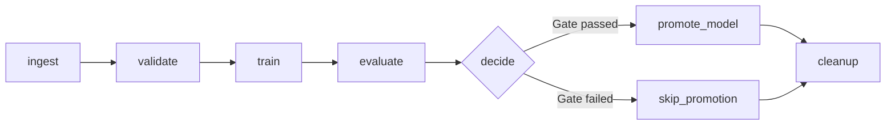

# Lab 2 Report — ML Pipeline & Experiment Tracking

**Course:** DDM501 — AI in DevOps, DataOps, MLOps  
**Repository:** [msa36hn-ddm501-lab2](https://github.com/NamTe/msa36hn-ddm501-lab2)  
**Report date:** 29 September 2026


## 1. Pipeline design

### Five stages and responsibilities

The main entry point is the Airflow DAG `credit_default_training`, defined in
[`dags/credit_training_dag.py`](../dags/credit_training_dag.py). A scheduled or
manual DAG run coordinates the pipeline by calling the shared functions in
`pipeline/`. The five logical stages map to eight Airflow tasks: `ingest`,
`validate`, `train`, `evaluate`, `decide`, `promote_model`, `skip_promotion`,
and `cleanup`. Branch selection and cleanup support the five-stage workflow.

| Stage | Responsibility | Main output |
|---|---|---|
| Ingest (`ingest`) | Load the CSV using `data_ingestion.py`, calculate statistics, create the stratified split, and save it to shared storage. | `raw.parquet`, `split.joblib`, and XCom dataset statistics and directory path. |
| Validate (`validate`) | Check the saved raw data's schema, statistics, and business meaning using `validation.py`; stop on invalid data. | `validation_report.json` and the validation report in XCom. |
| Train (`train`) | Load the saved split, engineer features, fit preprocessing and the estimator, and record the run in MLflow. | `model.joblib`, MLflow artifacts, and the run ID in XCom. |
| Evaluate (`evaluate`) | Score the held-out data, compute aggregate and per-group metrics, and measure selection-rate disparity. | `evaluation.json`, MLflow metrics, and scalar metrics in XCom. |
| Decide and promote (`decide`, `promote_model` / `skip_promotion`) | Apply the quality gate, select a branch, and register and compare eligible candidates with the existing champion. | Gate and promotion results in XCom; registered version and eligible alias when promotion runs. |

`cleanup` removes the temporary run directory after the selected branch completes
successfully. MLflow retains the logged artifacts. The alternative local entry
point, [`pipeline/run_pipeline.py`](../pipeline/run_pipeline.py), uses the same
pipeline functions and writes `artifacts/last_run.json`; that summary file is a
CLI output, not an output generated by the DAG.

### Validation as a separate gate

Validation runs after ingestion and before training; these positions are complementary. Ingestion establishes that the file can be loaded, while validation establishes that its contents are suitable for training. Keeping validation separate makes its result explicit, reusable by the CLI and DAG, and available as an MLflow artifact. A readable CSV can still contain invalid categories, implausible ages, or a broken target distribution.

The validator checks required numeric columns, a minimum of 5,000 rows, at most 2% missing values per column, and a target positive rate between 5% and 60%. Semantic checks cover categorical domains, age and credit-limit ranges, repayment-delay ranges, and nonnegative payment amounts. It collects errors across the three levels and raises `DataValidationError` before any model is fitted.

The DAG's ingestion task creates the split first, but the downstream validation task still blocks training if the raw dataset is invalid. Creating a split does not fit preprocessing or the model. The alternative CLI validates before splitting. In both paths, failed validation prevents model fitting and promotion.

### Features and leakage prevention

The split uses `test_size=0.2`, `random_state=501`, and stratification on `default_payment_next_month`: 24,000 training rows and 6,000 test rows. Six features extend the 23 raw predictors to 29 inputs:

| Derived feature | Calculation |
|---|---|
| `utilisation_ratio` | Mean bill amount divided by credit limit, clipped to [0, 5]. |
| `payment_ratio` | First-month payment divided by first-month bill, clipped to [0, 5]. |
| `max_delay` | Maximum repayment-delay value across six months. |
| `n_months_delayed` | Number of months whose repayment-delay value exceeds zero. |
| `avg_bill_amt` | Mean of six bill amounts. |
| `avg_pay_amt` | Mean of six payment amounts. |

Feature engineering returns a copy and replaces zero denominators with NaN. The numeric transformer applies median imputation and standard scaling. Categorical features (`SEX`, `EDUCATION`, and `MARRIAGE`) are one-hot encoded, with unknown categories ignored. The transformer is fitted inside the sklearn pipeline on training data only, so test-set statistics do not influence imputation or scaling.

Feature derivation itself is called before the fitted sklearn pipeline. Consequently, reusing the saved model on raw rows requires `prepare_features` first.

The DAG graph and task-level XCom evidence are documented in section 4. The
following CLI capture provides additional evidence that the shared pipeline
functions can also run locally.


*The initial HGB run completed evaluation and registered version 1 as champion, with ROC AUC 0.7473, PR AUC 0.5444, and fairness gap 0.0306.*

## 2. Experiment analysis

### Sweep design and results

[`experiments/run_experiments.py`](../experiments/run_experiments.py) evaluates seven configurations on the same split. Each configuration receives its own MLflow run. The shared data, seed, preprocessing, and decision threshold make comparisons more meaningful than independently resampling data for every model.

| Run | Configuration |
|---|---|
| `logreg-01` | C=0.1, max_iter=1000 |
| `logreg-02` | C=1.0, max_iter=1000 |
| `rf-03` | n_estimators=200, max_depth=8, min_samples_leaf=20 |
| `rf-04` | n_estimators=300, max_depth=12, min_samples_leaf=20 |
| `hgb-05` | max_iter=200, learning_rate=0.10, max_depth=4, l2_regularization=1.0 |
| `hgb-06` | max_iter=300, learning_rate=0.06, max_depth=6, l2_regularization=1.0 |
| `hgb-07` | max_iter=500, learning_rate=0.03, max_depth=8, l2_regularization=2.0 |

The following leaderboard reproduces the screenshot at four-decimal precision. It lists the seven sweep runs; the screenshot also includes the initial HGB CLI run.

| Run | Model family | ROC AUC | PR AUC | Recall | Fairness gap |
|---|---|---:|---:|---:|---:|
| logreg-01 | Logistic regression | 0.7511 | 0.5534 | 0.5068 | 0.0558 |
| logreg-02 | Logistic regression | 0.7511 | 0.5534 | 0.5068 | 0.0544 |
| rf-04 | Random forest | 0.7502 | 0.5406 | 0.4860 | 0.0352 |
| hgb-05 | Histogram gradient boosting | 0.7486 | 0.5468 | 0.4832 | 0.0368 |
| rf-03 | Random forest | 0.7482 | 0.5393 | 0.4832 | 0.0324 |
| hgb-07 | Histogram gradient boosting | 0.7475 | 0.5435 | 0.4853 | 0.0276 |
| hgb-06 | Histogram gradient boosting | 0.7473 | 0.5444 | 0.4817 | 0.0306 |


### What the sweep reveals

Logistic regression has the highest displayed ROC AUC, PR AUC, and recall. Increasing C from 0.1 to 1.0 leaves these displayed metrics unchanged but reduces the fairness gap from 0.0558 to 0.0544. The screenshot does not establish equality beyond four decimal places.

The larger random forest improves ROC AUC from 0.7482 to 0.7502 and PR AUC from 0.5393 to 0.5406, while its fairness gap rises from 0.0324 to 0.0352. More model capacity therefore improves some predictive metrics without improving every objective.

Among HGB configurations, `hgb-05` has the highest ROC AUC and PR AUC. The deeper, longer-running `hgb-07` has the smallest fairness gap in the sweep, 0.0276, but lower ROC AUC and PR AUC than `hgb-05`. Several hyperparameters change together, so the sweep does not isolate the effect of depth or learning rate individually.

The ROC AUC spread is small: 0.0038 from the highest to lowest displayed score. The fairness gaps differ more visibly, from 2.76 to 5.58 percentage points. A single ranking therefore hides a meaningful trade-off between predictive discrimination and group selection rates.

The metric named `pr_auc` is implemented with sklearn's `average_precision_score`. Recall and other classification metrics use a probability threshold of 0.30. Fairness gap is the maximum minus minimum selection rate across eligible `SEX` groups, where selection means predicted probability >= 0.30. It measures selection-rate disparity, not equality of error rates or proof of fairness. Groups with fewer than 50 rows or a single target class are omitted; group coverage must therefore be checked alongside the gap.

These results use one held-out split repeatedly to compare configurations. They support the lab decision, but do not establish statistical significance or unbiased final performance after selection. A separate final holdout or cross-validation would strengthen a deployment assessment.

## 3. The promotion decision

I would promote **logreg-02**, run ID **`961a96b0d277465b8f36aed9ac1172a7`**, using the initial HGB champion as the comparison baseline.

| Promotion check | Configured rule | logreg-02 | Result |
|---|---|---:|---|
| ROC AUC | >= 0.70 | 0.7511 | Pass |
| PR AUC | >= 0.45 | 0.5534 | Pass |
| Fairness gap | <= 0.10 | 0.0544 | Pass |
| Improvement over initial HGB | ROC AUC gain >= 0.002 | Approximately 0.0038 | Pass |

Relative to the initial HGB model, recall increases from 0.4817 to 0.5068, a gain of 2.51 percentage points, and PR AUC increases from 0.5444 to 0.5534. I accept the fairness-gap increase from 0.0306 to 0.0544 because it remains within the preconfigured limit while predictive performance improves. I would keep the 0.10 gate and continue inspecting per-group selection and error metrics rather than relaxing the limit to accommodate a preferred model.

Between the two logistic regression runs, I choose `logreg-02` for its smaller fairness gap with the other reported leaderboard metrics tied. If a substantially tighter disparity requirement were adopted, the decision would need to be revisited; `hgb-07` offers a smaller gap at some cost in predictive performance.

The registry function registers every candidate it processes. Failed candidates receive a `quality_gate: failed` tag and no new alias; passing candidates become champion only if they exceed the current champion by the 0.002 margin, otherwise they become challenger. Missing gate metrics fail the checks. The automated comparison uses the champion at execution time, so the gain calculated above is specifically against the initial HGB baseline.


*MLflow displays rounded values: ROC AUC 0.75, PR AUC 0.55, precision 0.53, recall 0.51, F1 0.52, and Brier score 0.14.*


*The registry capture shows version 5 as champion and version 7 as challenger. The logreg-02 artifacts capture links to version 4. These views do not identify version 5's source run, so they do not independently confirm that the champion is logreg-02. The recommendation above is supported by the leaderboard.*

## 4. Orchestration

The [`credit_default_training` DAG](../dags/credit_training_dag.py) calls the same pipeline functions as the CLI. It runs weekly by default, disables catchup, permits one active run, and retries tasks once after two minutes.



### XCom and shared storage

| Transport | Contents | Reason |
|---|---|---|
| XCom | Run-directory path, dataset summary, validation-report dictionary, MLflow run ID, scalar evaluation metrics, gate result, and promotion result. | Small metadata lets tasks locate outputs and make decisions without transferring model or dataset objects through the metadata database. |
| Shared run directory | `raw.parquet`, `split.joblib`, `validation_report.json`, `model.joblib`, and full `evaluation.json`. | DataFrames, fitted models, and detailed results are passed as files accessible to downstream tasks. |
| MLflow artifact store | Fitted model, feature list, validation report, evaluation report, and environment metadata. | Durable experiment evidence remains available after temporary run files are cleaned up. |

`decide` returns the exact downstream task ID: `promote_model` or `skip_promotion`. Selecting the promotion branch means the candidate passed the gate; the registry function still determines whether it becomes champion or challenger. The cleanup trigger rule, `none_failed_min_one_success`, allows cleanup after one branch succeeds and the other is skipped. It does not clean up a failed upstream run, so failed-run scratch files can remain.

There is a difference between the CLI registry path and the DAG's failure branch: the CLI calls `promote_model` for rejected candidates and records a rejected version, while the DAG uses an `EmptyOperator` for `skip_promotion`. Thus a DAG gate failure does not register a rejected version through that branch, although its MLflow training and evaluation run remains recorded.

### Observed manual-run XCom evidence

The supplied XCom records trace a manual run through ingestion, evaluation,
branching, registration, and cleanup. Its working directory is
`/opt/airflow/artifacts/manual__2026-09-28T17_57_18.568921_00_00`, and its
MLflow run ID is **`c6c290c174da4f0a985bcc762142bf81`**. This is a separate run
from the selected `logreg-02` sweep run and from the scheduled run in the graph
screenshot below.

| Task | XCom evidence | Interpretation |
|---|---|---|
| `ingest` | `data_stats`: 30,000 rows, 24 columns, positive rate 0.2329, missing values 0; `run_dir`: the path above. | Tasks exchange a dataset summary and storage location rather than the DataFrame. |
| `validate` | `validation_report`: `passed=True`, 30,000 rows, 24 columns, empty schema/statistical/semantic error lists, and `n_errors=0`. | All three configured validation levels passed before training. |
| `train` | `mlflow_run_id`: `c6c290c174da4f0a985bcc762142bf81`. | Links the DAG execution to the tracked model and evaluation. |
| `evaluate` | A dictionary of scalar metrics, including ROC AUC, PR AUC, fairness gap, and confusion counts. | The decision task receives the numbers needed for the gate without loading the model. |
| `decide` | `quality_gate.passed=True`, `failed_checks=[]`; `return_value=promote_model`; `skipmixin_key={'followed': ['promote_model']}`. | All configured checks passed and Airflow selected the promotion branch. `skipmixin_key` is Airflow's branch bookkeeping. |
| `promote_model` | Model `credit-default-classifier`, version `6`, outcome `challenger`, with the same MLflow run ID; return value `credit-default-classifier v6: challenger`. | The run was registered but did not replace the champion. |
| `cleanup` | `removed /opt/airflow/artifacts/manual__2026-09-28T17_57_18.568921_00_00`. | The cleanup callable reached its removal path and returned for this manual run. |

The validation payload records the complete data-quality result:

```json
{
  "passed": true,
  "n_rows": 30000,
  "n_columns": 24,
  "schema_errors": [],
  "statistical_errors": [],
  "semantic_errors": [],
  "n_errors": 0
}
```

The dimensions agree with ingestion, and all three error lists are empty. This
confirms that the dataset passed the implemented checks before training;
it does not imply that every possible data-quality issue was tested.

The evaluation payload provides a numerical audit of the decision:

| Metric | XCom value, rounded to six decimals | Gate rule |
|---|---:|---|
| ROC AUC | 0.747278 | >= 0.70 — pass |
| PR AUC | 0.544433 | >= 0.45 — pass |
| Fairness gap | 0.030649 | <= 0.10 — pass |
| Precision | 0.555739 | Reported, not gated |
| Recall | 0.481747 | Reported, not gated |
| F1 | 0.516104 | Reported, not gated |
| Brier score | 0.144791 | Reported, not gated |
| Decision threshold | 0.300000 | Used for classification and selection rates |

The confusion counts are TP=673, FP=538, FN=724, and TN=4,065. They total
6,000 test cases, consistent with the 20% holdout. The 1,397 positive test cases
represent approximately 23.28% of the holdout, close to the full dataset's
23.29% positive rate and consistent with stratification.

This run demonstrates the two separate decisions: **passing the quality gate
selects the promotion task, but does not guarantee the champion alias**.
Version 6 became challenger. Under the implemented registry logic, that outcome
means the candidate did not meet the required improvement over the champion at
that time. The XCom extract does not include the champion's score, so the exact
comparison cannot be reconstructed from this payload alone.

The later registry screenshot places `challenger` on version 7. This is
consistent with aliases moving between versions; it does not invalidate the
earlier version 6 outcome. The metrics here match the initial HGB results, but
the supplied XCom payload does not explicitly include `model_type`, so it is
identified by run ID rather than assumed to be the selected logistic regression run.

The cleanup return value provides evidence beyond the earlier queued screenshot.
It is not an independent filesystem check: the implementation uses
`shutil.rmtree(..., ignore_errors=True)`. Likewise, XCom values alone are not a
final DAG-state export. A graph or run-details capture showing final success
would complete the visual evidence for this manual run.


*The scheduled-run capture shows successful tasks through `promote_model`, with `skip_promotion` skipped and cleanup queued. The separate manual-run XCom evidence above records cleanup execution; it does not change the state shown in this earlier screenshot.*


*PostgreSQL, MLflow, the Airflow scheduler, and the webserver are running in the captured Docker view.*

## 5. Reproducibility

To reproduce the selected configuration, run the pipeline again with logistic regression, **C=1.0** and **max_iter=1000**, matching the parameters recorded for logreg-02. The new execution creates its own MLflow run ID; it does not need to reuse the original ID.

Use the same committed dataset, **data/credit_default.csv**, and the same feature-engineering code. Keep the stratified 80/20 split, **RANDOM_STATE=501**, **TEST_SIZE=0.2**, and evaluation threshold **REVIEW_THRESHOLD=0.30**. The recorded feature list and validation report provide references for checking the inputs, while the model's environment files identify the original Python and library versions.

Run the configuration through Airflow as follows:

1. In the shared Airflow environment block in **docker-compose.yml**, set **MODEL_TYPE: logreg**. Confirm that the logistic regression configuration in **pipeline/config.py** has **C=1.0** and **max_iter=1000**, and retain the data, split, seed, and threshold settings above. The DAG reads the model type from the task environment.
2. From the repository root, run **docker compose up -d --build** to start or recreate the services with the configuration.
3. Open Airflow at **http://localhost:8080**, unpause **credit_default_training**, and trigger a new run. The DAG loads and validates the data, trains the selected model, evaluates it, and applies the promotion rules.
4. Open the new MLflow run using **mlflow_run_id** from the train task's XCom. Compare its evaluation results with the selected experiment: ROC AUC **0.7511**, PR AUC **0.5534**, recall **0.5068**, and fairness gap **0.0544**.

The aim is to reproduce the training configuration and evaluate whether it yields consistent results, not to retain a run ID, model version, or alias. The promotion outcome may differ because it depends on the champion at execution time. The original sweep and Airflow use different dependency environments, so exact numerical agreement has not yet been demonstrated; compare the logged environment files if the results differ.
